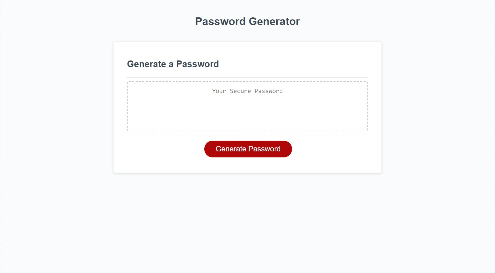

Password Generator

Description
This is a webpage that contains a script made from JavaScript that will generate a password that asks the user to enter a password length between 8 and 128 characters. It will then ask the user for password preferences and will generate a password according to those preferences. Every password will be unique.

Installation
N/A

Usage
To generate a unique password that will have conform to the users needs and preferences.

Credits
N/A

License
Please refer to the LICENSE in the repo.

https://github.com/physixkz/freddy-guerra-pass-generator

https://physixkz.github.io/freddy-guerra-pass-generator/